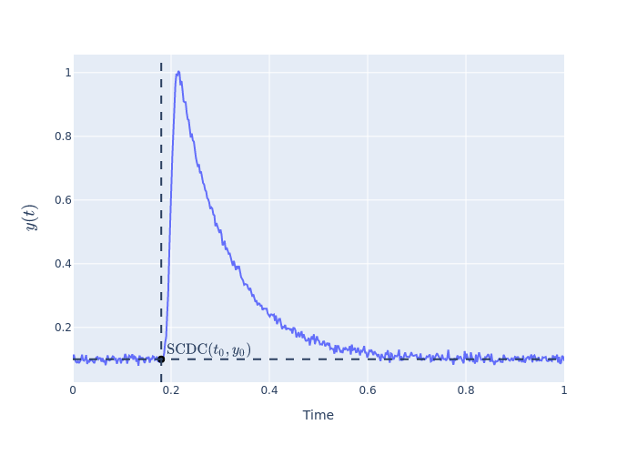

# Deep Learning Solution for the SCDC Problem <!-- omit in toc -->

This repo provides a deep learning solution for [the SCDC problem](#Problem).

1. A sequential neural network was trained with a dataset of decay curves.
2. The dataset was created by solving an ordinary differential equation.
3. `keras-tuner` was used to tune the hyperparameters of the neural network.

- [Problem](#problem)
- [Usage](#usage)
- [License](#license)

## Problem

We have measured a bunch of decay curves such as those of a carrier relaxation process,
and we have discovered most of them are well fitted with a two-componential exponential function as followed:

$$y(t) = A_1 \exp{(-t/\tau_1)} + A_2 \exp{(-t/\tau_2)}$$

where $y(t)$ is an output as a function of time like a PL intensity, $A_1$ and $A_2$ are weighting coefficients, and $\tau_1$ and $\tau_2$ are decay times.

Before fitting the function to a curve, we have to find the start coordinates of a decay curve(SCDC) in order to get an accurate decay time.
The calculated decay time, however, depended heavily on who analyzed the data or who created a function that returns SCDC, because we didn't have an established way to determine SCDC.

Now, we are trying to solve this problem with a deep learning algorithm.

## Usage

TODO: Add description

## License

[MIT License](./LICENSE)

Copyright (c) 2022 Shuhei Nitta
